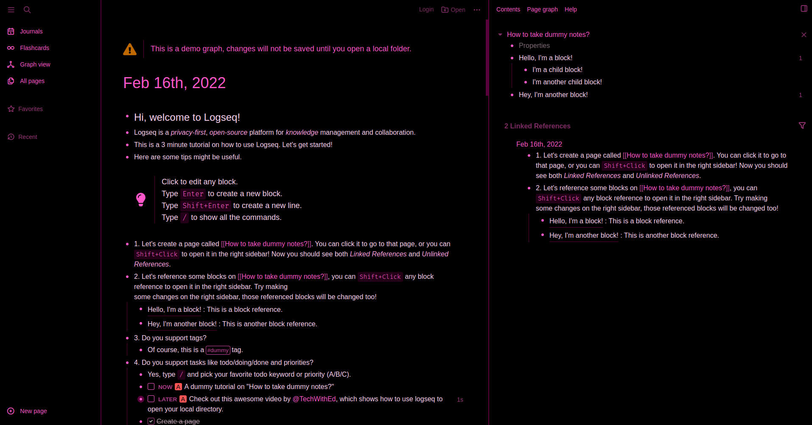

# Pink as Fox Theme for [Logseq](http://logseq.com)

> A black theme for [Logseq](http://logseq.com) based on [draculatheme.com/logseq](https://draculatheme.com/logseq)

## Install

### Offline install:

- Copy the content of `custom.css` into `logseq/custom.css` in your notes repo if you want to have the theme available without an internet connection.

### Online install:

- Paste this line to your `logseq/custom.css` file:
- `@import url('https://cdn.jsdelivr.net/gh/avoonix/logseq-pink-as-fox-theme@master/custom.css');`

OR

- Paste this line to your `logseq/config.edn` file:
- `:custom-css-url "@import url('https://cdn.jsdelivr.net/gh/avoonix/logseq-pink-as-fox-theme@master/custom.css');"`
